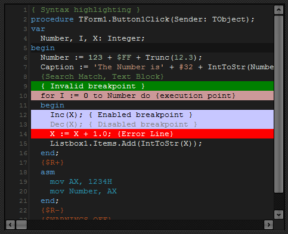

# Visual Studio Code theme for DITE

A theme for [Delphi IDE Theme (DITE)](https://github.com/RRUZ/delphi-ide-theme-editor/) based on **Visual Studio Code** Dark Theme, while using my **Pascal** language extension.

I created this theme mostly to unify the experience while developing with **Delphi** and **Visual Studio Code**.

## Features

* Dark Theme
* Same colors for the basic language elements 
* Active line is simply _darker_ because Delphi doesn't support _borders_

## Installation

* Clone the repo 
* Copy the `visual-studio-code.theme.xml` file to the location where DITE stores the extensions. It should be something like `C:\ProgramData\DITE\Themes`.
* After that, you should see a new theme called **visual-studio-code**

> You can check the location using the _Settings_ button inside **DITE**

## License

[MIT](LICENSE.md) &copy; Alessandro Fragnani

---

 a :coffee: and you will help me to keep working on this project :wink:

 uma :coffee: e você vai me ajudar a continuar trabalhando neste projeto :wink: